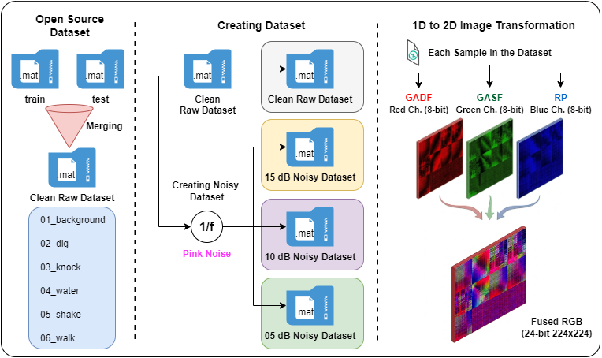
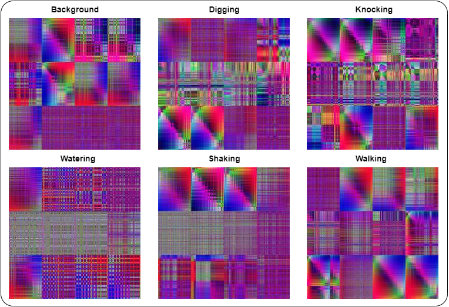
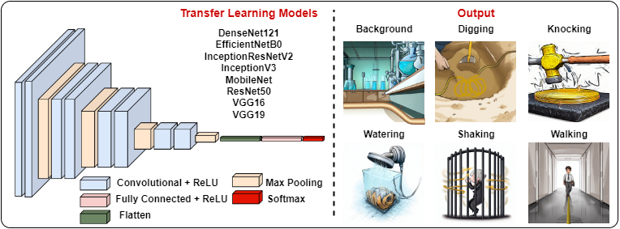

# $\Phi$-OTDR Event Detection Using Image-Based Data Transformation and Deep Learning

[](https://doi.org/10.1007/s10044-026-01694-z)

This repository contains the official implementation of the paper: **"$\Phi$-OTDR Event Detection Using Image-Based Data Transformation and Deep Learning"**, published in Pattern Analysis and Applications (2026).

**Authors:** Muhammet Cagri Yeke, Samil Sirin, Kivilcim Yuksel, and Abdurrahman Gumus

---

## Overview

Phase-sensitive Optical Time-Domain Reflectometer ($\Phi$-OTDR) systems serve as highly precise distributed sensing technologies to monitor vibrational and acoustic events along optical fibers. However, extracting signature patterns from 1D phase traces is inherently limited by environmental noise and non-linear strain behaviors across distinct disturbance types.

This project implements a novel **early data-level fusion** framework that converts 1D temporal signal matrix datasets into rich, multi-channel 2D RGB image representations. By combining three distinct time-to-image mapping techniques—Gramian Angular Difference Field (GADF), Gramian Angular Summation Field (GASF), and Recurrence Plot (RP)—the pipeline captures complementary mathematical and temporal perspectives into separate color channels. These optimized representations are processed via pre-trained Deep Learning models (such as **EfficientNetB0** and **DenseNet121**) under a transfer learning fine-tuning paradigm, achieving test classification accuracies of up to **99.07%**.

---

## Key Features & Scientific Contributions

Existing distributed fiber-optic sensing frameworks predominantly rely on isolated single-transformation methods, bypassing the rich analytical perspectives gained by combining distinct domain encodings. To bridge these literature gaps, this repository introduces a hardware-friendly, noise-resilient framework characterized by the following breakthroughs:

* **Early Data-Level Sensor Fusion:** Rather than relying on complex late feature-level fusion, this project introduces a native early data-level fusion strategy. By mapping GADF, GASF, and RP straight into the Red, Green, and Blue channels of a single image matrix, the model captures orthogonal temporal and geometric perspectives simultaneously.
* **Drastic Storage Footprint Compression:** Transforming raw 1D matrices into optimized multi-channel representations condenses the total dataset storage capacity from **2.03 GB down to a lightweight 180 MB**. This massive reduction protects critical event fingerprints while heavily optimizing high-speed I/O data pipelines.
* **Systematic Robustness against 1/f Pink Noise:** Real-world $\Phi$-OTDR systems are prone to environmental background noise. This codebase includes a stress-testing module that injects synthesized 1/f pink noise ($\alpha = 1$) to prove model resilience across rigorous field conditions (**15 dB, 10 dB, and 5 dB SNR**). 
* **Real-Time Edge Deployment Viability:** By yoking optimized data transformations to highly efficient, pre-trained Convolutional Neural Networks, the end-to-end processing execution pipeline runs in **under 40 ms per event**, making it uniquely viable for real-time edge computing and critical infrastructure monitoring.

---

## Framework Architecture & Visualizations

The following figures illustrate the core transformation pipeline and the structural differences captured by the multi-channel early fusion approach:


*Figure 1: End-to-end framework illustrating dataset aggregation, 1/f noise injection, and 1D-to-2D multi-channel image transformation.*


*Figure 2: Examples of the fused 24-bit RGB representations (GADF, GASF, RP) across six distinct event classes.*


*Figure 3: Transfer learning model architecture leveraging pre-trained CNN backbones for multi-class event classification.*

---

## 📂 Project Architecture

The repository is strictly structured into data management and source code directories to ensure modularity and ease of reproducibility. 

```text
📦 Phi-OTDR-Event-Detection
 ┣ 📂 assets                           # Directory for README figures and visual diagrams
 ┃ ┣ 🖼️ fig1.png
 ┃ ┣ 🖼️ fig2.png
 ┃ ┗ 🖼️ fig3.png
 ┣ 📂 data                             # Data processing pipeline directories
 ┃ ┣ 📂 0_downloaded_dataset           # Initial raw files from the open-source dataset
 ┃ ┣ 📂 1_raw_clean                    # Aggregated noise-free signals
 ┃ ┣ 📂 2_noisy_mat                    # Synthesized 15dB, 10dB, 5dB SNR cohorts
 ┃ ┣ 📂 3_single_channel_images        # Outputs from 1D to 2D transformations (GADF, GASF, RP)
 ┃ ┗ 📂 4_final_datasets               # Final fused 224x224 RGB datasets ready for CNN models
 ┣ 📂 src                              # Source code directory
 ┃ ┣ 📜 0_prepare_raw_data.py          # Combines initial datasets into a unified structure
 ┃ ┣ 📜 1_noise_injection.py           # Synthesizes and injects 1/f pink noise
 ┃ ┣ 📜 2_image_generation.py          # Transforms 1D traces to GADF, GASF, and RP matrices
 ┃ ┣ 📜 3_image_fusion.py              # Fuses matrices into lightweight RGB representations
 ┃ ┗ 📜 4_train_benchmark.py           # Executes transfer learning and performance evaluation
 ┣ 📜 .gitignore                       # Ignores large datasets (data/) and local cache files
 ┣ 📜 requirements.txt                 # Project dependencies
 ┣ 📜 README.md                        # Project documentation
 ┗ 📜 LICENSE                          # MIT License

---

## Installation & Setup

Clone the repository and install the required dependencies:

git clone https://github.com/miralab-ai/Phase-OTDR-event-detection.git
cd Phase-OTDR-event-detection
pip install -r requirements.txt

---

## Project Pipeline & Step-by-Step Execution

The workflow is completely modularized. Navigate to the src directory and execute the scripts sequentially:

### Step 0: Raw Data Aggregation
* Script: 0_prepare_raw_data.py
* Execution: Combines split .mat files into a unified master dataset within the 1_raw_clean directory.
python src/0_prepare_raw_data.py

### Step 1: Robust Environmental Noise Simulation
* Script: 1_noise_injection.py
* Execution: Injects 1/f pink noise into baseline signals to construct degraded cohorts at 15 dB, 10 dB, and 5 dB SNR levels.
python src/1_noise_injection.py

### Step 2: 1D to 2D Signal Transformation
* Script: 2_image_generation.py
* Execution: Maps signals into separate grayscale representations via GADF, GASF, and RP matrix kernels.
python src/2_image_generation.py

### Step 3: Multi-Channel Sensor Fusion & Compression
* Script: 3_image_fusion.py
* Execution: Maps transformation views into RGB color spaces (GADF->Red, GASF->Green, RP->Blue), compressing data size.
python src/3_image_fusion.py

### Step 4: Model Training & Benchmarking
* Script: 4_train_benchmark.py
* Execution: Iterates across all cohorts using pre-trained backbones.
python src/4_train_benchmark.py

---

## Computational Efficiency & Optimization

* Matrix Optimization: The codebase utilizes a fixed resolution of N=500 during the generation phase to balance information preservation and execution speed.
* Training Strategies: The pipeline supports both feature extraction (Trainable: False) and fine-tuning (Trainable: True) via the lrn_typ configuration flag.
* Real-Time Latency: The end-to-end pipeline operates in under 40 ms per event, making it viable for real-time edge computing.

---

## Citation & Acknowledgment

If you find this repository useful in your research, please cite our paper:

@article{Yeke2026,
  author  = {Yeke, Muhammet Cagri and Sirin, Samil and Yuksel, Kivilcim and Gumus, Abdurrahman},
  title   = {$\Phi$-{OTDR} event detection using image-based data transformation and deep learning},
  journal = {Pattern Analysis and Applications},
  year    = {2026},
  volume  = {29},
  number  = {3},
  pages   = {114},
  doi     = {10.1007/s10044-026-01694-z},
  url     = {https://doi.org/10.1007/s10044-026-01694-z}
}

The raw data utilized is based on the open-source dataset provided by Cao et al.:
> Cao, X., Su, Y., Jin, Z., & Yu, K. (2023). An open dataset of $\Phi$-OTDR events with two classification models as baselines. Results in Optics, 10, 100372. https://doi.org/10.1016/j.rio.2023.100372

## License
This project is licensed under the MIT License.
